# Teilprüfung1 GitHub/GitLab(K4.0057_2.0_Z)

## Aufgabe: GitHub Repository Setup und Worflow

Name: Michael Herrmann  14.02.2025

| Eigenschaft | Wert | Hinweis |
| --- | --- | --- |
| Lizenz | - |  |
| Host ID | - |  |

### Aufgabenbeschreibung:
Bitte folgende Aufgabe umfangreich mit Screenshots protokollieren und das lokale Git-Repository-Verzeichnis als Zip-Datei mit abgeben.

In dieser Übung sollst du ein Git-Repository in GitHub anlegen und einen Workflow einrichten, der das lokale Klonen des Repositories, das Erstellen eines SSH-Schlüssels und das Konfigurieren der nötigen Git-Einstellungen umfasst. Folge den Schritten und erledige die Aufgaben in der angegebenen Reihenfolge.

a) GitHub Repository Setup: 

1. Gehe zu GitHub (www.github.com) und melde dich mit deinem Benutzerkonto an. Falls du noch kein Konto hast, registriere dich kostenlos.

2. Nach dem Login klicke auf "+ New" (oben rechts) und erstelle ein neues leeres Repository mit dem Namen "MeinProjekt".

3. Notiere dir die URL des erstellten Repositories, sie wird später benötigt.

b) SSH-Schlüssel erstellen: 

4. Öffne dein Terminal (Linux/Mac) oder Git Bash (Windows).

5. Überprüfe, ob du bereits einen SSH-Schlüssel hast, indem du den folgenden Befehl ausführst: ls ~/.ssh/

6. Falls die Ausgabe Dateien wie id_rsa und id_rsa.pub enthält, hast du bereits einen SSH-Schlüssel. In diesem Fall kannst du zu Teil 3 springen. Wenn die Dateien nicht existieren, erstelle einen neuen SSH-Schlüssel mit dem folgenden Befehl: bash ssh-keygen -t rsa -b 4096 -C "deine_email@beispiel.com" Beachte, dass "deine_email@beispiel.com" durch deine GitHub-E-Mail-Adresse ersetzt werden muss.

7. Der Befehl wird dich nach dem Speicherort des Schlüssels fragen und optional nach einem Passwort. Du kannst den Standard-Speicherort akzeptieren und ein Passwort festlegen oder es leer lassen (kein Passwort).

c) Lokales Repository einrichten und Workflow: 

8. Gehe in deinem Terminal zu dem Verzeichnis, in dem du dein lokales Git-Repository erstellen möchtest.

9. Klone das GitHub-Repository "MeinProjekt" mit dem folgenden Befehl: bash git clone git@github.com:DeinBenutzername/MeinProjekt.git .Ersetze "DeinBenutzername" durch deinen GitHub-Benutzernamen. Der Befehl klont das Repository auf deinen lokalen Rechner.

10. Navigiere in das geklonte Verzeichnis "MeinProjekt":

    cd MeinProjekt

11. Konfiguriere Git mit deinem Namen und E-Mail, die mit GitHub verknüpft sind:

     git config user.name "Dein Name"

     git config user.email "deine_email@beispiel.com"

     Ersetze "Dein Name" und "deine_email@beispiel.com" durch deine echten Daten.

12. Füge eine neue Datei hinzu (z. B. "main.py") und erstelle einen Initial-Commit:

     git add main.py

     git commit -m "Initialer Commit"

13. Erstelle einen neuen Branch mit dem Namen "feature":

     git checkout -b feature

14. Füge eine weitere Datei hinzu (z. B. "utils/database.py") und erstelle einen Commit auf dem "feature"-Branch:

     git add utils/database.py
     git commit -m "Neue Funktion hinzugefügt"

15. Bearbeite die Datei "main.py" und führe einen Commit auf dem "feature"-Branch durch:

     git add main.py
     git commit -m "Hauptdatei aktualisiert"

16. Wechsle zurück zum "master"-Branch:

     git checkout master

17. Bearbeite die Datei "main.py" und führe einen Commit auf dem "master"-Branch durch:

     git add main.py
     git commit -m "Hauptdatei aktualisiert"

18. Versuche nun den "feature"-Branch in den "master"-Branch zu mergen:

     git merge feature

Beachte: Dieser Schritt ist absichtlich so gestaltet, dass ein Merge-Konflikt entsteht, da sowohl der "master"- als auch der "feature"-Branch Änderungen an der "main.py"-Datei vorgenommen haben.

 

Hinweis: Achte darauf, die Schritte sorgfältig auszuführen und alle nötigen Befehle richtig einzugeben. Wenn du bei Schritt 17 auf einen Merge-Konflikt stößt, versuche zu verstehen, warum dieser auftritt und wie du ihn beheben könntest (Hinweis: du musst den Konflikt manuell auflösen, indem du die richtigen Zeilen auswählst). Wenn du Schwierigkeiten hast, kannst du gerne nachfragen oder die Dokumentation zu Git und GitHub konsultieren.

### Lösung:
     Punkt a) Setup
Eigenes Konto erstellen mit den Namem BVHerrmann und eine neues Repository erstellen mit dem Namen "meinProjekt".

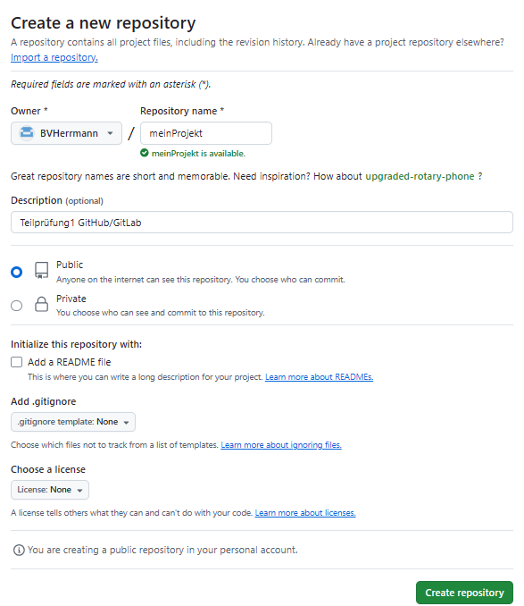

Die URL für diese Projekt lautet:
 https://github.com/BVHerrmann/meinProjekt.git

     Punkt b) SSH-Schlüssel erstellen

  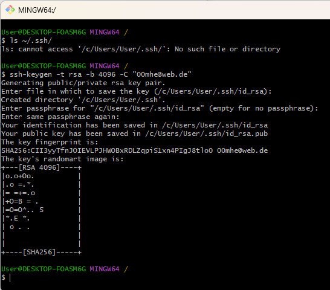 

  Das neu erstellte Repository "meinProjekt" mit einer README.md-Datei  

  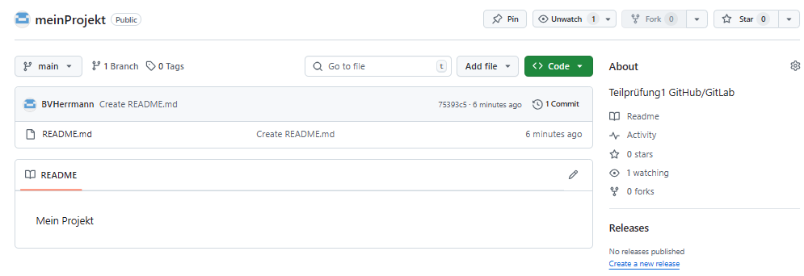 

     Punkt c) Lokales Repository einrichten und Workflow

Repository clonen:

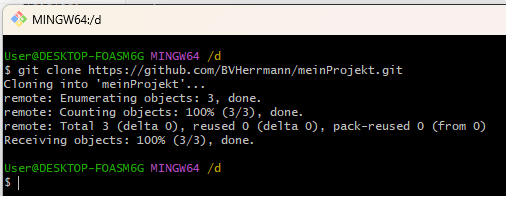 

Konfiguiere Projekt:

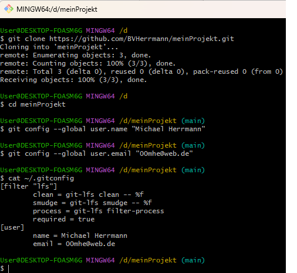 

Neue Datei(main.py) hinzufügen:

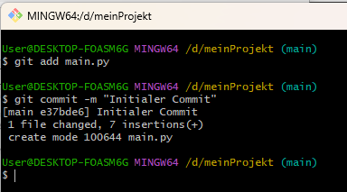

Neuen Branch "feature" erstellen

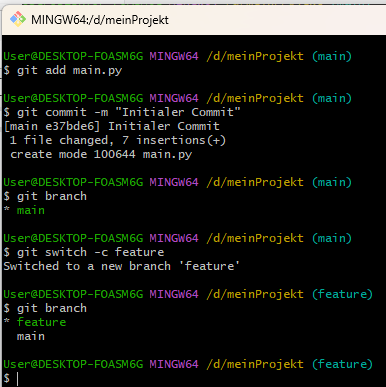

Wechsel zum feature Branch und hinzufügen von utils/database.py

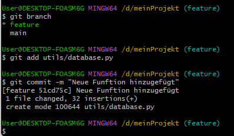

Date main.py im feature branch ändern.

Inhalt der Datei vor der Ämderung:

     import os
     import json
     os.system("cls")
     from tkinter import Tk

     fenster = Tk()
     fenster.mainloop()

Inhalt der Datei nach der Änderung:

     import os
     import json
     os.system("cls")
     from tkinter import Tk

     fenster = Tk()
     fenster.mainloop()

     # Neue Funktion hinzugekommen im feature branch
     def write_default_file(path_name:str,data:list):
     try:
      with open(path_name,'w', encoding='utf-8') as stream:
          for item in data:
              stream.write(item + FEED_BACK_SEPERATOR)
          stream.close()
     except Exception as e:
        print('Can not write file: ',path_name,e)

Hauptdatei ist committet im feature Branch:

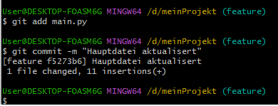

Wechsel zum main Branch und main.py verändern.
Inhalt der Datei main.py nach der Änderung im main Branch:

     import os
     import json
     os.system("cls")
     from tkinter import Tk

     fenster = Tk()
     fenster.mainloop()

     #Hinzugefügt im main branch
     def erzeuge_zufallszahlen_liste(n):
      return [random.randint(1, 100) for _ in range(n)]

Jetzt feature-Branch mit main-Branch meragen.

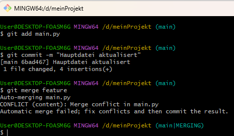

Inhalt der main.py-Datei mit den Konflikt:

     import os
     import json
     os.system("cls")
     from tkinter import Tk

     fenster = Tk()
     fenster.mainloop()

     <<<<<<< HEAD
     #Hinzugefügt im main branch
     def erzeuge_zufallszahlen_liste(n):
      return [random.randint(1, 100) for _ in range(n)]
     =======

     # Neue Funktion hinzugekommen im feature branch
     def write_default_file(path_name:str,data:list):
     try:
      with open(path_name,'w', encoding='utf-8') as stream:
          for item in data:
              stream.write(item + FEED_BACK_SEPERATOR)
          stream.close()
     except Exception as e:
        print('Can not write file: ',path_name,e)
     >>>>>>> feature

Damit der Merge abgeschlossen müssen die Marker entfernt werden. Die Zeilen, die übernommen werden sollen, belässt man in der Datei. Die Zeilen, die nicht übernommen werden sollen, können aus der Datei entfernt werden.

Konflikt gelöst, feature wurde entfernt:

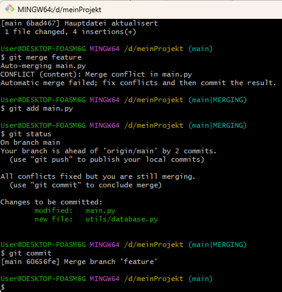

Projekt nach dem push im GitHub-Konto

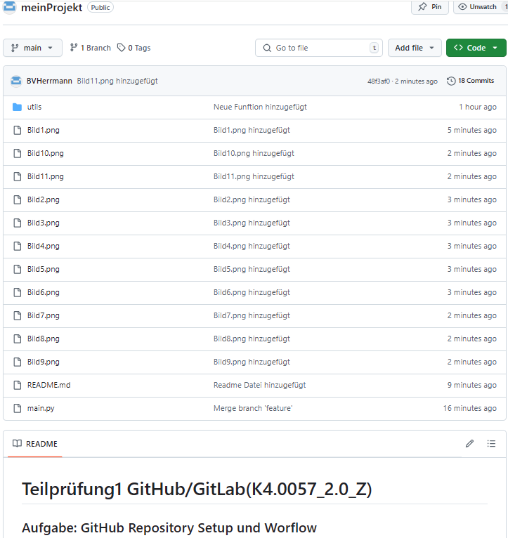

 